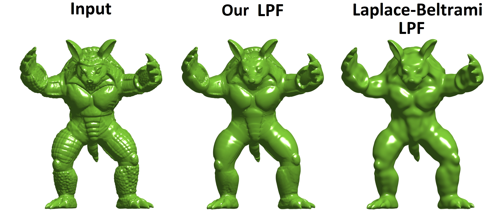

# shape-nonlinear-spectral
This project contains the original implementation of
[Nonlinear Spectral Processing of Shapes via Zero-Homogeneous Flows](https://www.springerprofessional.de/en/nonlinear-spectral-processing-of-shapes-via-zero-homogeneous-flo/19119118)
by Jonathan Brokman and Guy Gilboa (SSVM 2021).

**What will you find here?**
An efficient new nonlinear filtering framework(s) for triangulated mesh processing. Good for smoothing and enhancing mesh features.



## Requirements
We used MATLAB R2020a
## Data
Meshes where uploaded directly to this project, to "shape nonlinear spectral/meshes" directory
## Run algorithm
To reproduce results:

Download project in its original structure.

Code can be found in directory  "shape nonlinear spectral".

all scripts named "script_<some_suffix>.m" can run as is. Each script reproduces a results from the paper.

## Runtime
On our machine - most of the scripts take a minute or so, with one exception: script_LPF_armadil_LB_vs_M3.m may take a few hours - as it demonstrates the expensive classical SVD-based approach

## Citation
If you find our work useful, please cite our paper:
```bash
@article{Brokman2021ShapeSpectral,
  title={Nonlinear Spectral Processing of Shapes via Zero-Homogeneous Flows},
  author={Brokman, Jonathan and Gilboa, Guy},
  year={2021}
}
```

Hope you'll have fun like I did :)

Jonathan
